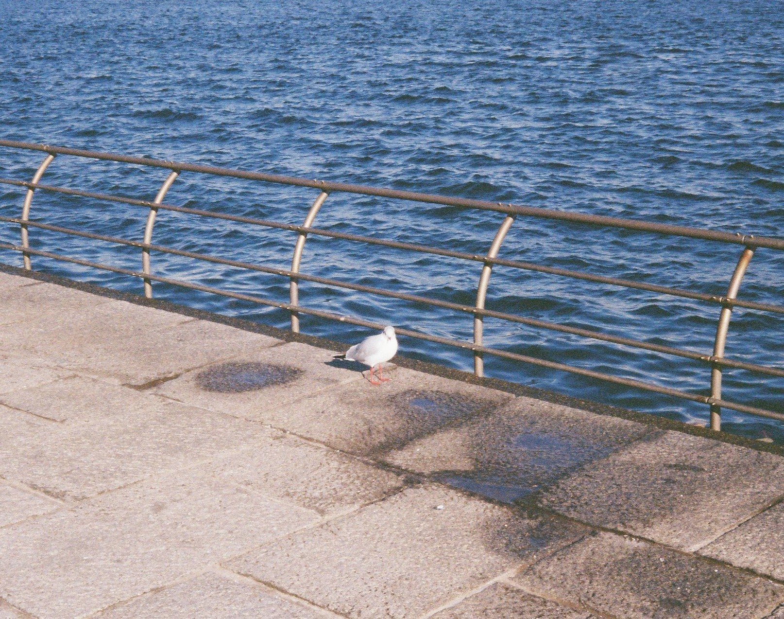
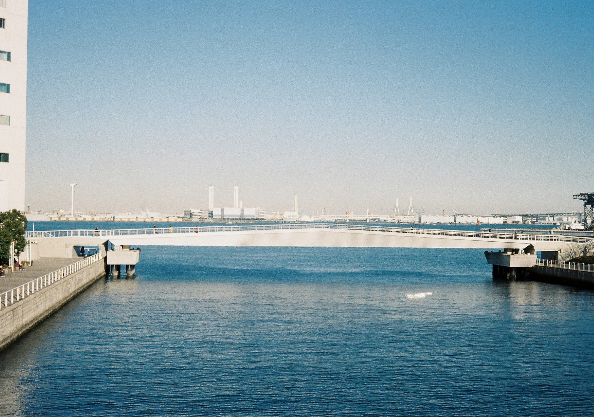
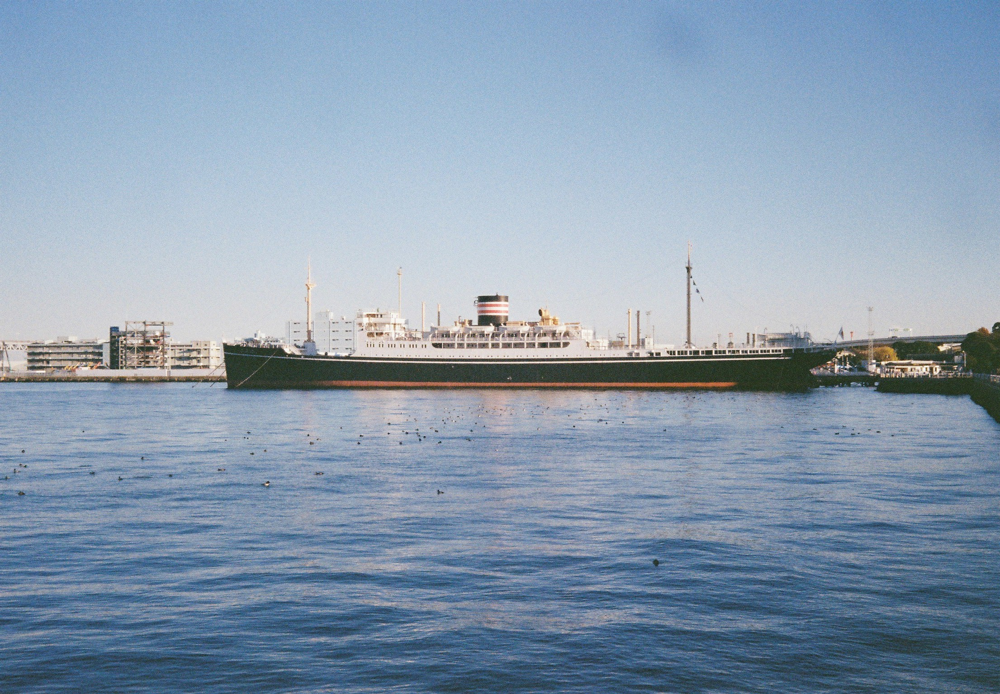
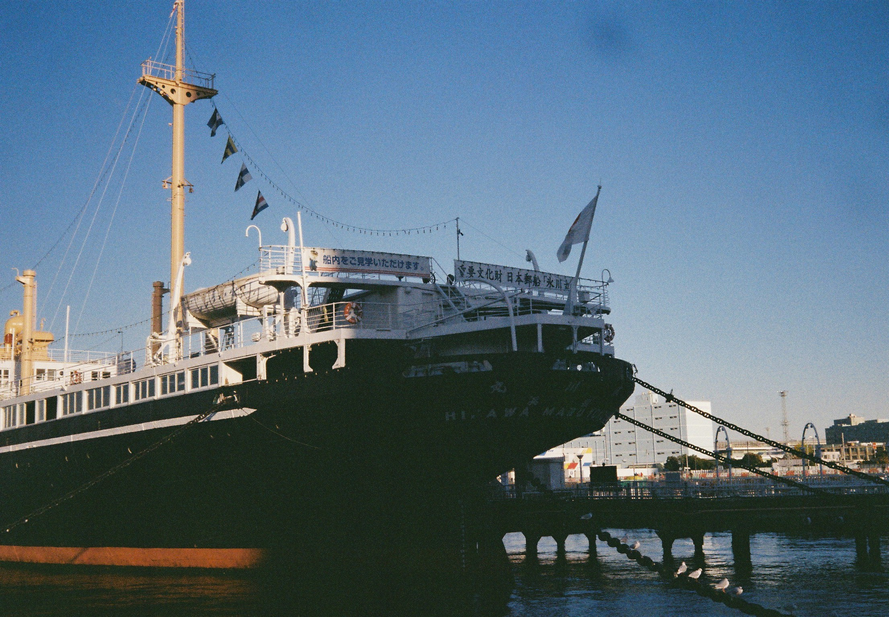
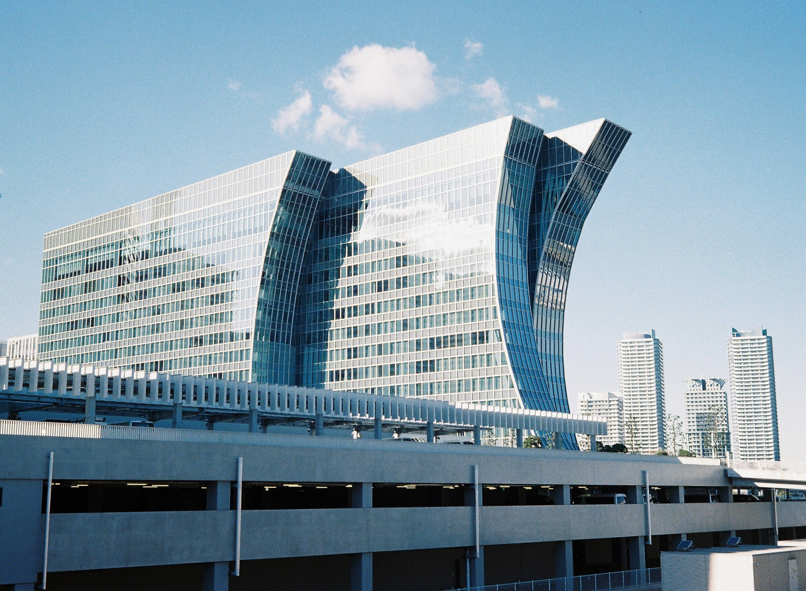
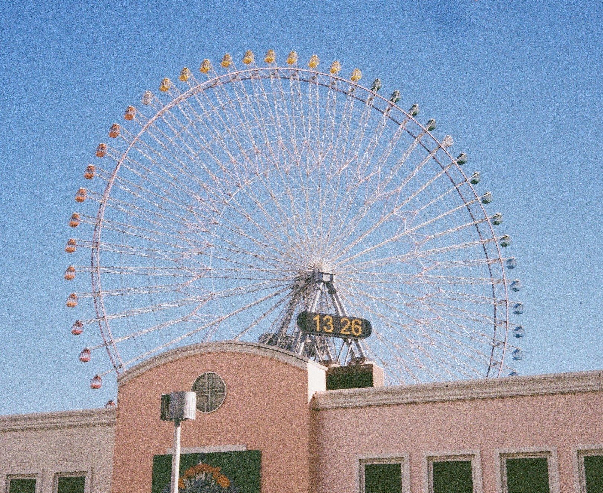
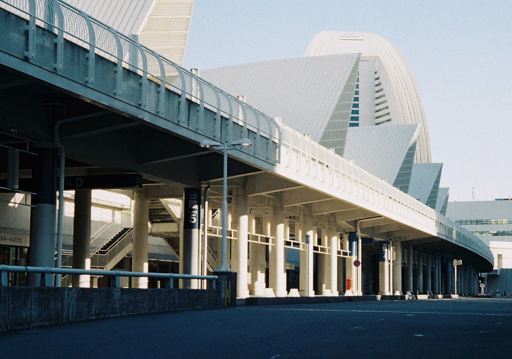
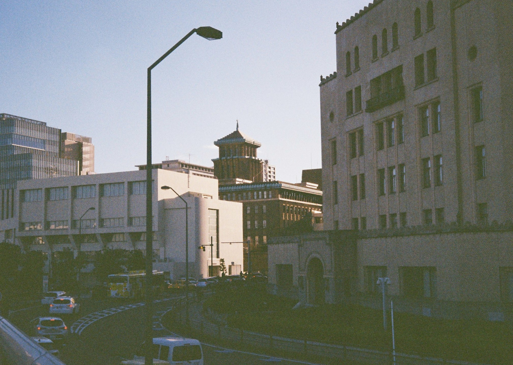
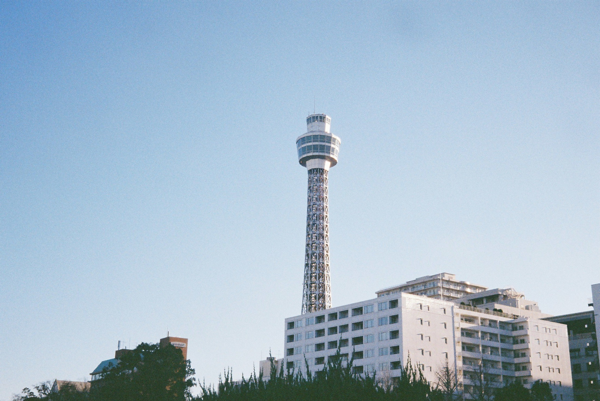

横滨（横浜，Yokohama），是一个位于东京周边的神奈川县内的海滨城市。从我宿舍门口的护国寺站出发，搭乘两站有乐町线到池袋，再换成JR湘南新宿线即可到达横滨，总共耗时1个小时左右。

到达横滨之前，我一直以为这是一个比较安逸的乡下小城，等出了车站，看到对面巨大的摩天轮以及充满现代感的高楼大厦才发觉自己的想法错得有多离谱。。。我是在工作日的下午去的，因此街道上的人很少，在海边公园里坐下听一会海浪声，然后再在时髦的冷色调建筑里穿梭……感觉实在是太棒了！！横滨有一块比较繁华的区域叫做港未来（みなとみらい），也有一条同名的电车线，我觉得这个名字非常贴合这座城市的气质。

关于横滨的照片都是用柯达ProImage拍摄的（这是人像卷，但是没人给我当模特，我就拍风景了），可能是因为胶卷过期了，再加上扫描仪的偏色，照片都带着偏蓝的冷色调，不过也正是因为如此，拍出来的大海和建筑都非常好看

**港口，船只和大海**

镜头上好像粘了灰尘，左上部分有一块黑影

**城市建筑**

我很喜欢这张，蓝得非常漂亮

港未来的硕大摩天轮

其实这张照片的场景用肉眼看非常漂亮，不过可能是因为当时是逆光拍的，拍出来的照片很昏暗。

