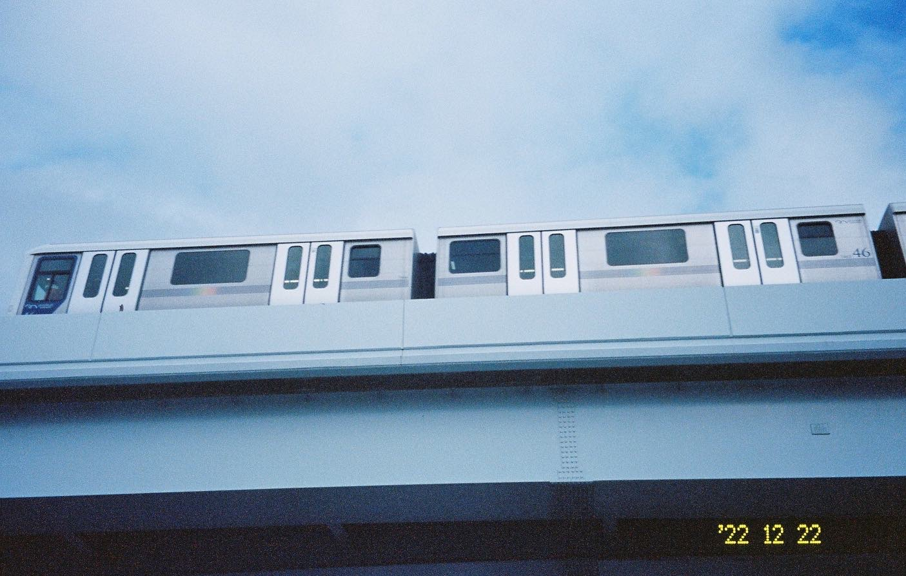
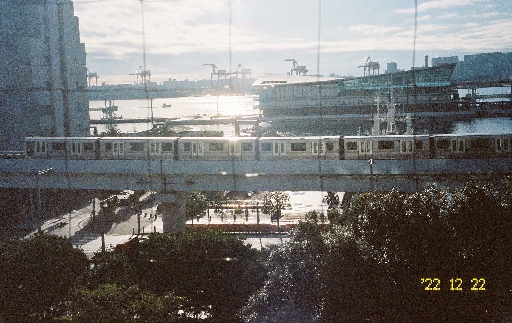
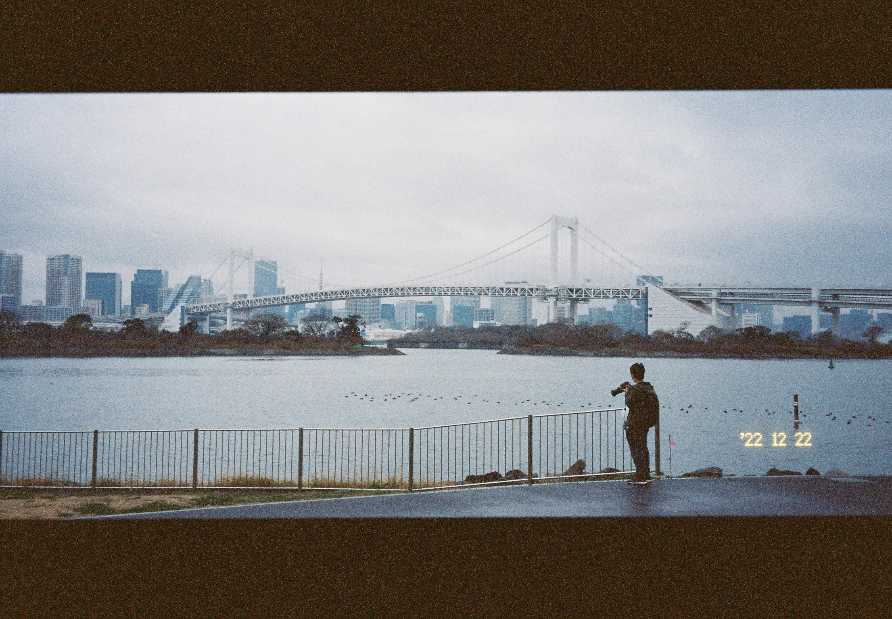
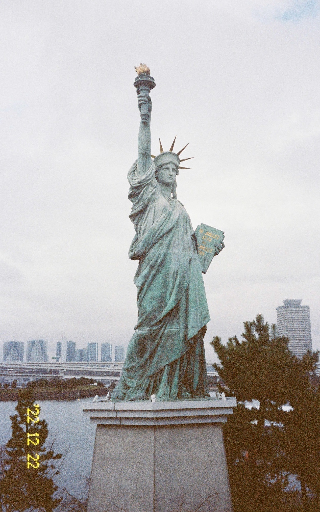
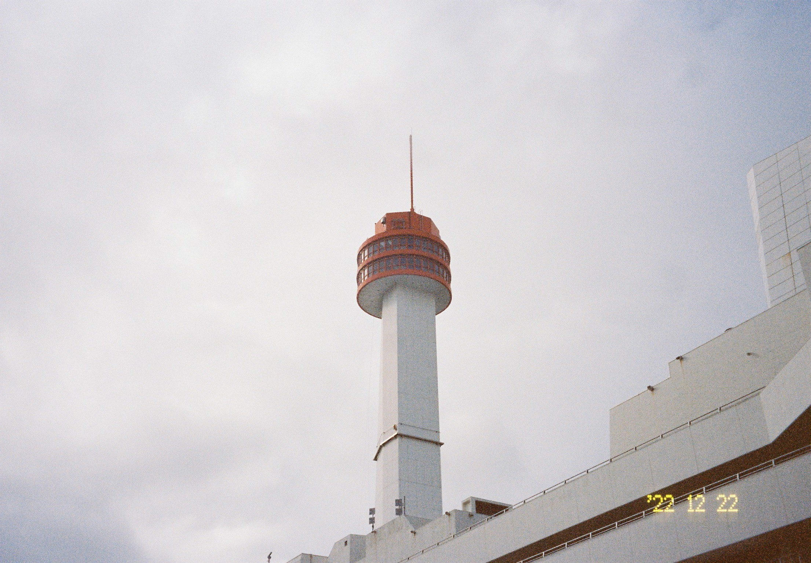
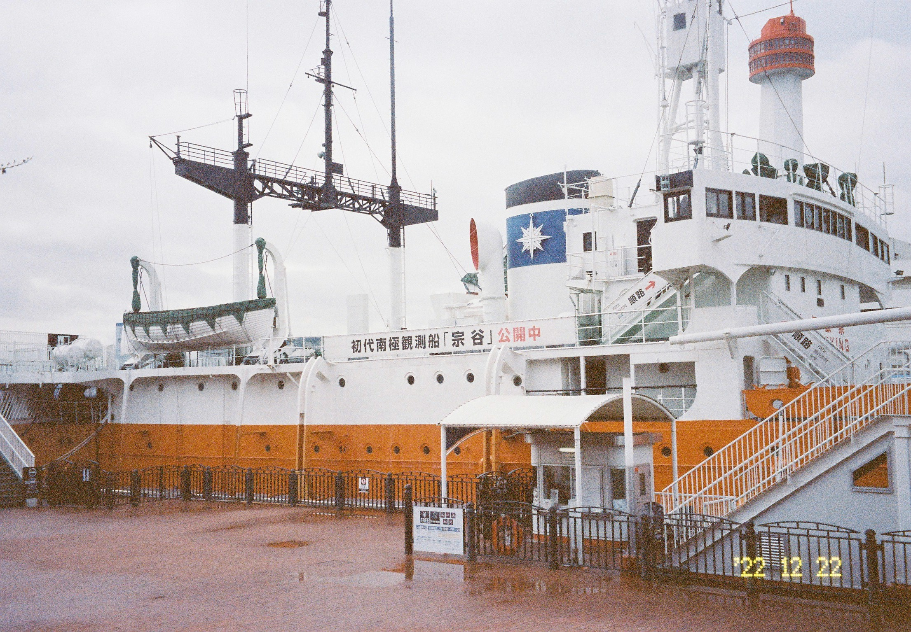
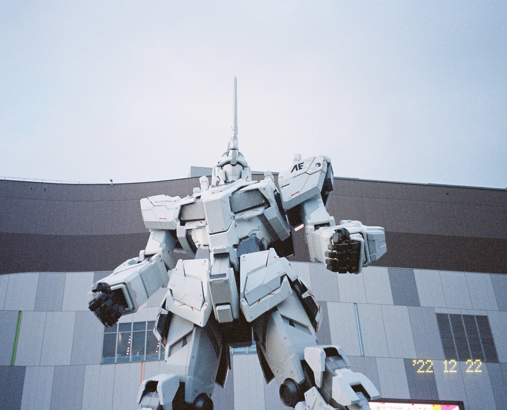

台场（台場，Daiba）是东京南部一块靠海的（据说是用垃圾填出来的）人工陆地。台场处于港区，江东区，品川区交界的地方，理论上似乎属于港区，不知道我这么说严不严谨。

从我住的地方乘坐有乐町线到丰州（豊洲，Toyosu，《东京女子图鉴》的女主角曾经在这里住过），然后再换乘海鸥线（它的名字叫ゆりかもめ Yurikamome，直译过来应该是百合海鸥线），就可以到达台场了。海鸥线是一条无人驾驶的电车线，由于线路周边的风景特别好，非常适合观光，所以经常能在车上见到各国的游客。如果运气比较好能坐在车头，还可以看见前方的轨道，会有一种在坐过山车的感觉。

**飞驰而过的海鸥线**

仰视视角的海鸥线，隐约能看见车头坐着一位红衣服的女士。

俯视视角的海鸥线：

**台场海滨公园**

台场海滨公园有一座自由女神像，是巴黎的自由女神像的仿制品。站在公园的沙滩上，可以隐隐约约看到远处的东京塔。

用为宽幅模式拍摄的照片，面前的小哥在拍风景，而我在拍他（笑）。

海滨公园的自由女神像：

**东京国际邮轮码头**

博客第二张照片里，海鸥线右上方那栋在海上的建筑就是东京国际邮轮码头。这附近还有一座船科学馆，不过很可惜我当时没时间进去逛，只是在外头拍了张照片。

船科学馆旁边的灯塔（我也不知道是不是灯塔，就当它是吧）

停在岸边的南极科考船“宗谷号”

**高达基地**

台场的标志性打卡地，除了海滨公园的那个自由女神像，还有位于DiverCity Tokyo Plaza（没有进去过，应该是一个购物中心） 门口的一个巨大的高达。

从照片里可以看出它有几层楼那么高，据说到了特定的时间还会变身。

### 关于照片

**前段时间新收了一台傻瓜机宾得espio145m，傻瓜机的第一卷胶卷大多都贡献给了台场。本篇博客中的照片全都是由这台傻瓜机拍摄，使用的胶卷是柯达portra400，冲扫店是池袋的ビックカメラ，他们的扫描仪有点问题，扫出来的照片很多都有些发蓝。**