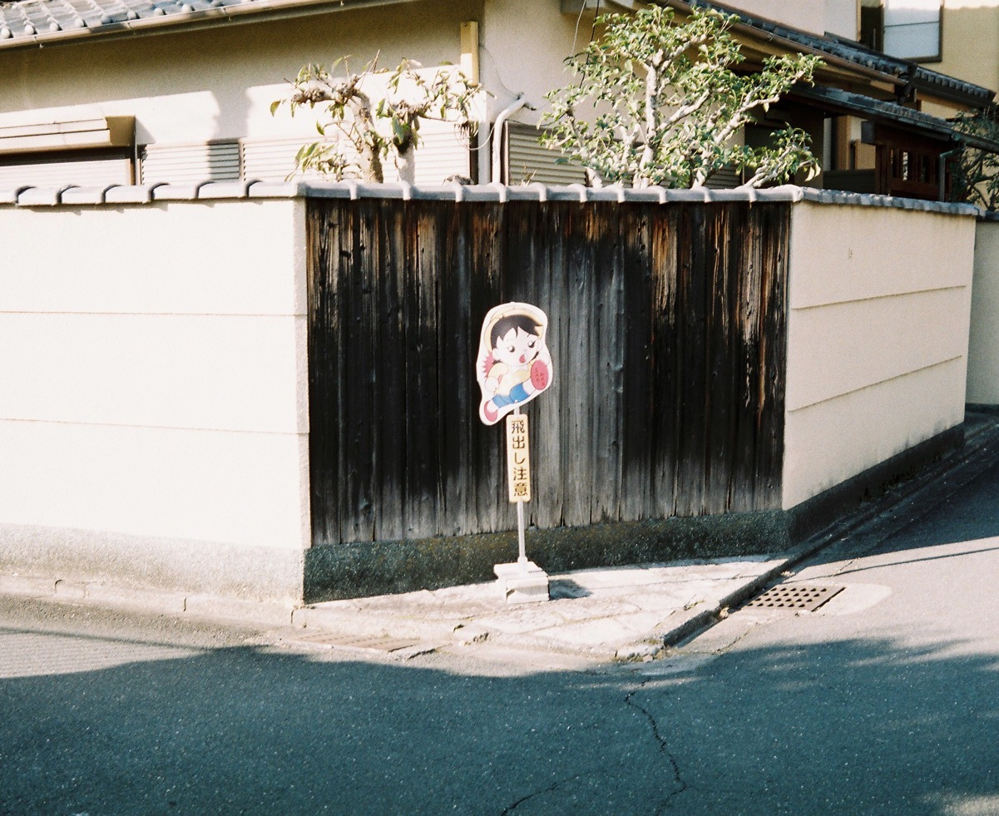

京都（Kyoto）是一个非常著名的旅游城市，由于它的知名度非常高，我来日本之前一直以为日本最发达的城市就是东京和京都（而且东京大学和京都大学也是日本最好的两所学校嘛），其实并不是这样。京都保留了很多古老的建筑，也有建筑限高，其实有点类似于苏州的老城区。如果光看繁华程度还有高楼大厦的数量的话，京都可能还不如它旁边的大阪和神户。

我把毕业旅行的第一站定在了关西，而关西旅行的第一站在京都。我是看了b站的一位up主的[胶片旅拍视频](https://www.bilibili.com/video/BV1sJ411x7zB?share_source=copy_web)之后产生了很强烈的想去京都旅行的愿望。不过很可惜的是，我在关西的那几天天气不太好，最后一天甚至还下起了大雨，因此在关西三个城市（京都，大阪，神户）总共只拍了一卷36张的彩色胶卷和一卷24张的黑白胶卷，其中只给大阪拍了一张照片（没办法，去大阪的那天下雨了），其余的照片都是在神户和京都拍的。

我在京都下榻的酒店位于京都南区，交通有些不方便，但是好在离鸭川只有几分钟步行的距离，早晨去鸭川河边转转还是很惬意的。这里我想吐槽一下京都各区和街道的命名方式，什么上京区，中京区下京区还有左右京区，还有什么三条五条九条十条，这么古色古香的一个城市，区域和街道的命名里全是数字和方位词的排列，看上去像是小学生想出来的，一点美感都没有好吗！

**关于照片**

彩色照片是使用**富士Xtra400 + 奥林巴斯35DC**拍摄的，而黑白照片是使用**伊尔福XP2+奥林巴斯XA**拍摄的。两卷胶卷的ISO都是400，其中XP2是可以用C41工艺冲扫的黑白胶卷。两部相机都是手动黄斑对焦（其实我挺讨厌黄斑对焦的）+自动快门，都是我在读本科的时候买的。其中XA应该是最小的黄斑对焦相机，还没有我的手掌大，揣在口袋里可以随时拿出来抓拍，可以自己调光圈，镜头也不错，我非常非常喜欢这台相机。然而可惜的是，这台相机刚买回来的时候后盖的海绵老化脱落了导致有些漏光，虽然我自己以非常拙劣的手法贴了新的海绵，但是洗出来的27张照片里仍然有几张是漏光的。

**鸭川**

鸭川是一条历史非常悠久的河流，长度有31公里，穿过了京都的中央地带。河岸两侧风景非常美，有工厂，餐厅，商店，还有很多古老的住宅。岸旁有供人步行的平台，经常可以看见有人在上面慢跑，骑车或者遛狗。

鸭川河岸的建筑

呼啸而过的电车

鸭川三角洲，在这里可以踩着大石头过河。这个场景在京阿尼的动画《玉子市场》里出现过。

**寺庙和神社**

京都的寺庙和神社特别特别多，我感觉在某些区域走两步就能遇到一个寺庙，我在去年12月的时候去过清水寺和金阁寺，这次旅行去了另外几个比较有名的寺庙和神社，比如三十三间堂，下鸭神社，南禅寺等等。

**金阁寺**

去的时候是阴天（似乎每次去京都都是阴天），但是金阁寺外面的金箔还是很闪，如果晴天去应该会更闪。

**南禅寺**

其实我的家乡也有一座南禅寺，不过京都的这座和家乡的南禅寺可完全不一样。京都的南禅寺造得非常大气，我觉得可能需要用中画幅或者大画幅的相机才能把整座寺庙全都拍进去。南禅寺在秋天枫叶变红的季节会非常好看，然而我是冬天去的，只能看见一些光秃秃的树杆子。不过淡季去的好处就是游客非常少。

可以看见这张照片里只有零零散散的几对游客，由于来的时间都差不多，我基本上是跟在他们屁股后面逛完的南禅寺。左边是一对穿和服的日本情侣，中间是一对白人老夫妇，有个日本导游在给他们拍照，右侧是两个韩国女孩（ps：我感觉京都的游客有一大半都是韩国人）。

再走近一点，光秃秃的树杆子看上去其实也不丑。

**街道，路边，小庭院**

我觉得京都的街道真的特别好看，两侧都是古老的小房子，有些人家里还会修建漂亮的庭院，工作日没什么游客，一个人漫步在这些小道上感觉非常棒。

去下鸭神社的路上拍的，当时短暂地出了一会太阳

飛出し注意，意思是注意路边突然窜出来的人

去南禅寺的路上拍的，一路上只有我一个人，路边全是这种复古风格的住宅

三十三间堂对面的寺庙里停着的小卡车。

一间住宅门口的自行车

清水五条附近的一条街，街道上有一个人力车夫。当时是傍晚，街道两侧的灯都亮了。其实如果用彩色胶片拍效果会更好，只不过车夫走得太快，当时还在下雨，我撑着伞追不上他，也来不及从包里掏出35DC，只能拿出口袋里的XA临时抓拍了一张。

飞驰而过的电车。这是我在去伏见稻荷大社的小路上拍的，轨道下是一条小河，两侧是密密麻麻的住宅。这些住宅看上去都有些年代了，住的都是一些老人（不会被电车吵得睡不着么）。拍照的时候电车离我很近，因为电车到来之前我刚刚猫着腰钻过轨道下高度1.4m的小隧道。

