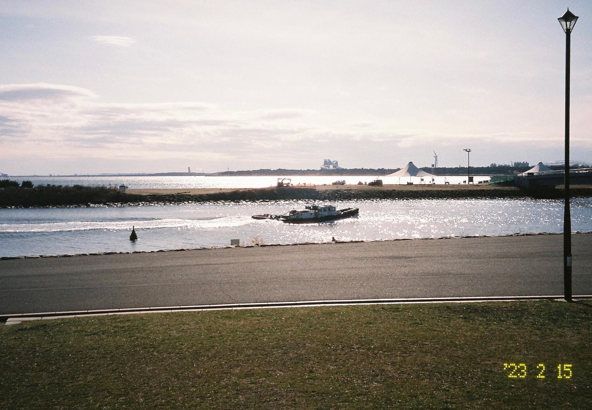

葛西临海公园（葛西臨海公園, Kasai Rinkai Park）是在东京江户川区的一座大型免费公园，毗邻东京湾，是东京最大的几个公园之一。而新宿御苑（Shinjyuku Gyoen），看名字就知道在新宿区，查了查面积大概是葛西临海公园的2/3左右，也能逛上非常久，进去需要门票，我对于在新宿这样寸土寸金的地方居然有如此大的一个公园感到非常惊讶。

我在工作日连着的两天下午去了这两个公园，因此就把它们放一块了。工作日逛公园的人少，体验非常好，有些地方的风景甚至可以独享。

**葛西临海公园**

去葛西临海公园的契机是偶然在小红书上刷到一篇帖子说这里有水仙花展，于是就去了，然而到了之后发现海景比水仙花好看很多。从我住的地方乘坐有乐町线到终点站新木场，然后换乘JR京叶线即可到达葛西临海公园。

公园里有一个很大的摩天轮，摩天轮下种了很多水仙。

一栋很漂亮的玻璃房子，可以爬到二楼看海。

其实肉眼看是非常漂亮的，因为前方没什么人，看上去非常干净剔透，可惜我拿相机拍不出这种感觉，摄影技术还需要磨炼吧。

爬上二楼的观景台拍摄的照片（在这里海风已经很大了）。

往前走是一个大草坪，有很多人躺在草坪上休息。玻璃房子前方有一个蓝色的餐车，可惜里面没人营业。

继续往前，就能看到大海了。

姐妹三人坐在一起聊天，很想加入他们

路人的背影，那位戴着帽子的女士独自在海边坐了很久，走在她前方的小哥给她拍了张照，我本来也想效仿小哥拍下她坐着的照片，但是很不巧的是我刚走过去她就起身离开了。

**新宿御苑**

去新宿御苑的契机也是小红书，我在刷小红书的时候看见了一篇说新宿御苑的樱花开了的帖子，于是前往。从我住的地方搭乘有乐町线到市ヶ谷，然后换乘都营新宿线到新宿三丁目，出站走一会就到了。说句题外话，新宿站据说有上百个出口，所以我离开的时候并没有从新宿三丁目坐车，而是去了新宿站，果然很大，当天只是逛了个公园并且在新宿站里找地铁就走了上万步。

用伪宽幅模式拍摄的照片（可以看出新宿御苑真的非常大），这个时候树上的花和叶子还没长出来，草坪也是黄色的，等到了春天应该会更好看。

我去新宿御苑的时候，只有几棵樱花树开放了，由于是工作日，游客并不多，就算如此樱花树下还是聚集了不少人。

樱花树下的一对情侣，两人应该是在低头看刚刚拍的照片。

精致的日式庭院，背景就是新宿的高楼建筑，很难想象这样安静优雅的公园居然坐落在繁华嘈杂的都市建筑群里。

我去的时候很多树还是光秃秃的，等3月樱花开放了再来一次吧。

---

**关于照片**

本篇博客的照片都是用Pentax espio145m以及富士premium400胶卷拍摄的。傻瓜机非常容易出片，想把它变成我的主力相机。