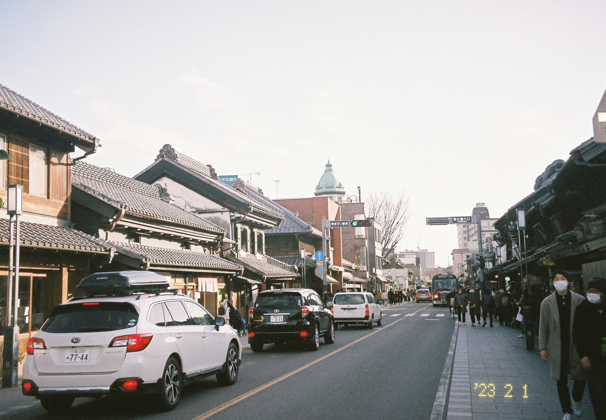
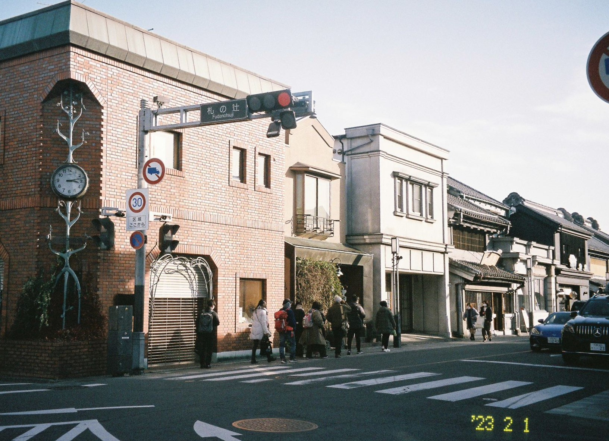
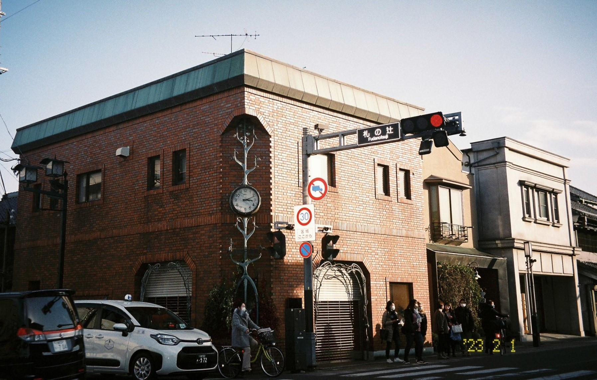
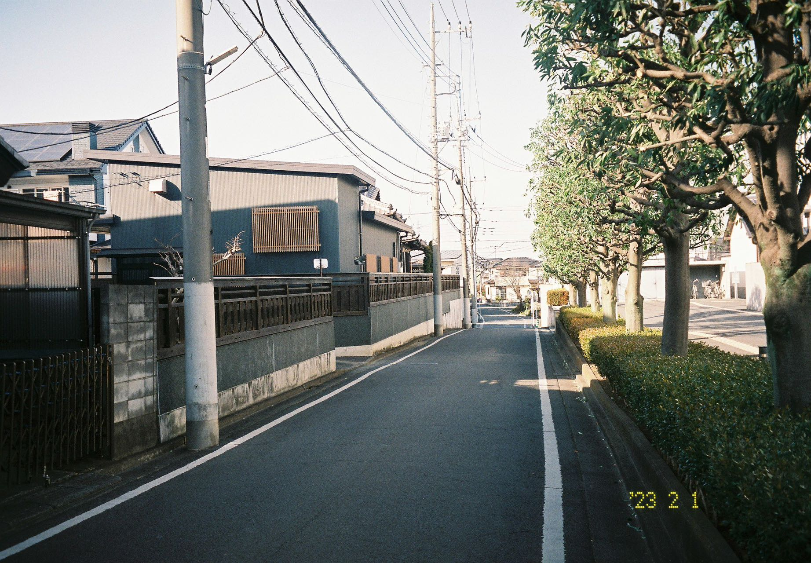
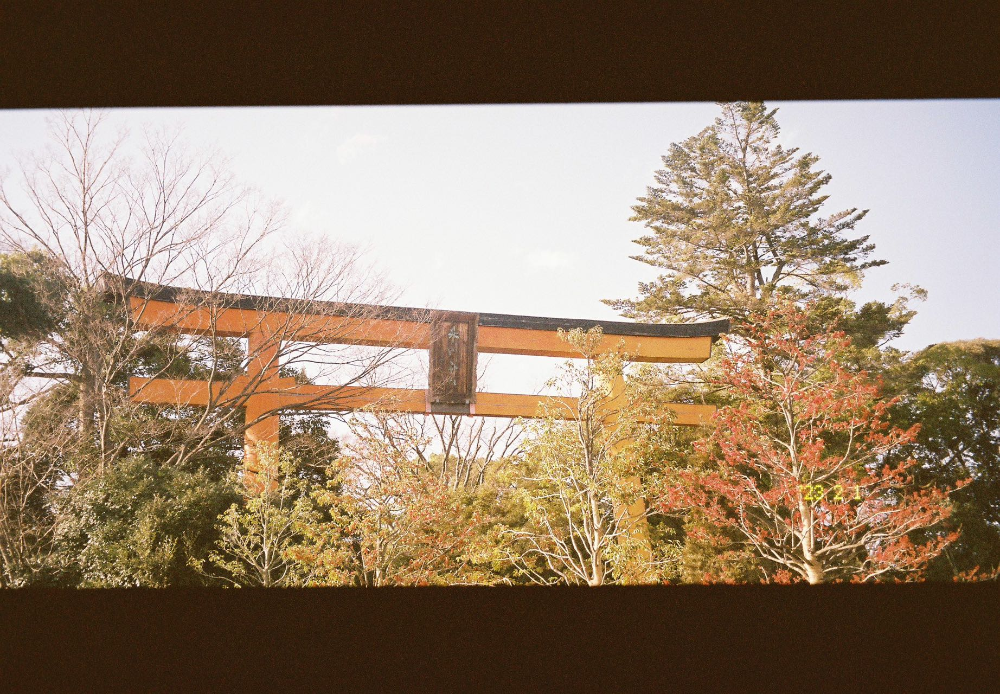
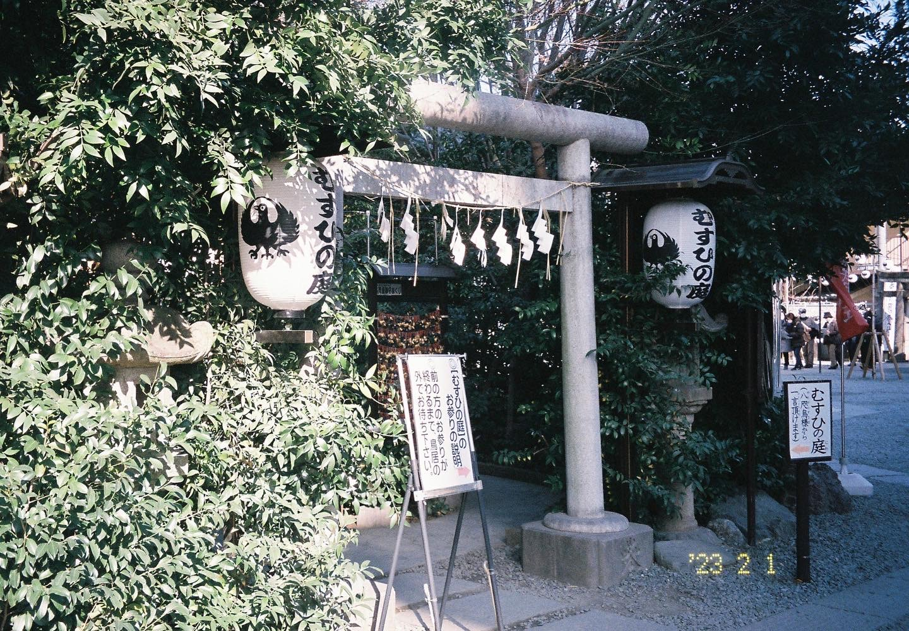

川越（Kawagoe）是东京周边的一个小城。川越市里面有很多江户时代风格的建筑，有一条“川越一番街”，给人的感觉类似于国内的古镇，路的两侧都是开在江户风建筑里的商店，还有一些博物馆。

乘坐东武东上线可以直达川越站，我宿舍门口的有乐町线有些班次开到一半会切到东武东上线上继续开（因此坐地铁之前要查好班次信息，不然可能会把你送到奇怪的地方去），不需要换乘就能直接到，我出门的时候很幸运地赶上了这样的一班地铁。虽然川越并不属于东京都（它是琦玉县的），但是因为就在东京周边，我直接把它归到[Tokyo Surroundings](https://photoji.github.io/categories#Tokyo-Surroundings)这个tag里面去了。

川越市是一个非常小的城市，市内有名的景点从车站出发徒步均可到达，一个下午就浏览得差不多了。川越市可逛的地方除了江户风建筑之外，还有很多寺庙和神社，其中包括据说求恋爱很灵的冰川神社。

我是在工作日去川越的，本以为人会很少，结果街上到处都是人，所以拍的照片很少。

**街道**

一番街有很多车和人

傍晚的一番街

小路

**神社**

用伪宽幅模式拍摄的冰川神社

庭院

---

**关于照片**

本篇博客里的照片是用Pentax espio145m以及富士premium400拍摄的。