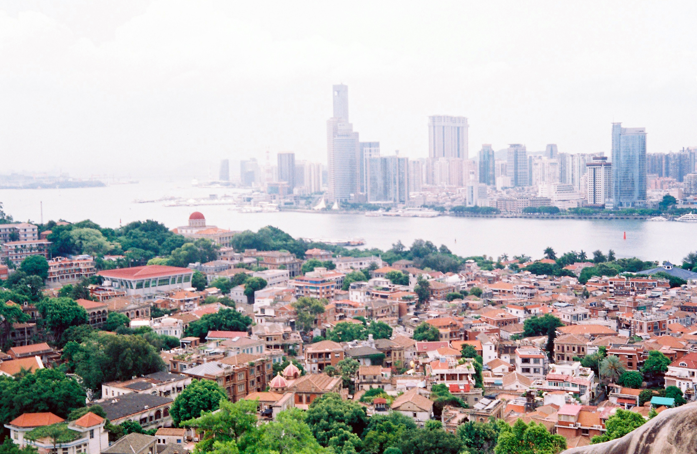

2020年的6月份，我顺利地拿到了本科毕业证书，和舍友计划着去厦门毕业旅行。虽然此时国内的新冠疫情已经被控制住了，但是人们可能还是有所顾虑，旅游业还没有完全恢复。

我依稀记得坐飞机去往厦门的那天，家里正下着小雨，而厦门的天气却非常晴朗。我下了飞机之后坐着BRT（这还是我第一次坐）前往酒店，车窗外是碧蓝的大海和热带风格的绿化带，让我意识到这是一个和家乡完全不一样的城市。

**鼓浪屿**

我在厦门待了差不多一个星期，中途去了鼓浪屿和福建土楼。我对鼓浪屿印象非常深刻，岛上不能开车，浏览景点全都要靠自己爬坡。鼓浪屿上有很多西式的别墅，这些别墅有的是居民自己居住，有的被拿来当做民宿对外开放，还有的被废弃了，周围长满了杂草。岛上的废弃建筑除了这些民居别墅之外，还有一些功能性的房子，比如日本警察署、仁爱医院旧址、废弃的疗养院（或者是养老院，我已经记不太清了），窗户上用红漆写着SOS的破旧大楼等等。不知道为何这种带点诡异气氛的废弃建筑特别吸引我，站在外面往里看能脑补出一大堆鬼故事。

鼓浪屿的红色建筑群

别墅群，和海滩

上下坡的台阶

鼓浪屿的海滩非常好看，由于当时游客不多，能很容易拍出好看的照片。

这张照跑焦了(原本是想对着两个女生对焦的)，但是我觉得很有意境。

在海边等日出的时候，有一个小哥爬到了灯塔上。

日出时的光景

傍晚的海滩

阴天下的大海

鼓浪屿某个小海滩拍到的景象，左下角两个人在练习划船

**厦门市内**

在厦门市内游玩的记忆已经有些模糊了，只记得我们去逛了海鲜市场，在沙滩旁边骑行，还吃了不少特色食物，比如海鲜烧烤和鸭子粥。

厦门猫街，但是一只猫都没看见。

黄厝海滩

---

**关于照片**

两年多之前拍的照片了，用的相机是olympus 35dc，用的什么胶卷已经记不清了。那个时候胶卷还没涨到现在这么离谱的价格，拍起照来没那么心疼，技术也不太行，跑焦手抖时常有，经常咔咔一顿乱拍之后一卷胶卷里只有几张能看的，不过就算如此，这些照片也都是很珍贵的回忆了。
