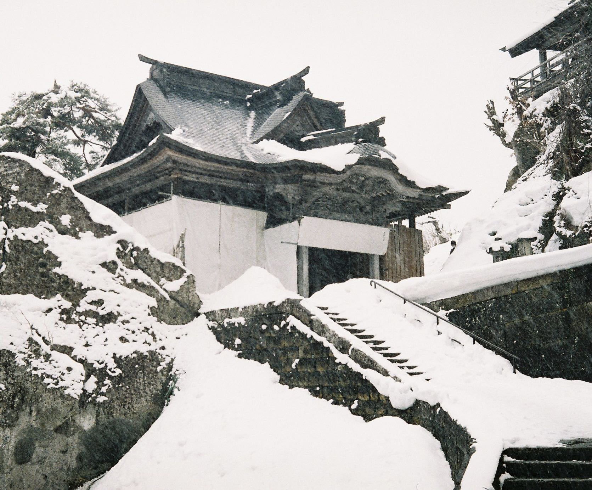

我在[这篇博客](https://photoji.github.io/films-aomori/)里提到，2月下旬的时候我去日本东北玩了四天三夜，其中去的一个景点就是山形的山寺。

我是从仙台出发前往山寺的。在仙台站乘坐仙山线，花上一个小时就可以到达山寺站。仙山线的班次很少，半个多小时才有一班，而山寺下午三天就不能上山了，所以一定要计划好出行时间。尽管班次间隔时间很长，但是乘坐电车的人并不多，上去之后基本上都有座位。从仙台出发时，外面下着小雪，随着电车一路往北开，小雪慢慢变成大雪，路两旁的风景也从楼房变成了积着厚厚的雪的悬崖和树林，电车开过时还会将两侧的积雪扬起来，模糊了窗外的风景。

在山寺站下车的基本上都是去爬山的游客，所以我出站后没有看手机导航而是直接跟着大部队走，很顺利地到达了山寺脚下。上山要买300日元的门票，售票处只有一个大叔（看来最近游客很少），我去的时候他正在门口铲雪，看见有人来了才慢悠悠地进了小屋收钱。

爬到山顶要走1000多级的台阶，看着很多，其实差不多半小时左右就能爬完了，不过山上积雪非常厚，当时还在下大雪，多少会耽误一些时间。其实难的并不是上山而是下山，我在上山的路上遇到了好几个在下山时脚下打滑溜下楼梯的游客。不过这种情况并没有发生在我身上，我穿了一对冰爪，下山时如履平地，绝对羡煞旁人了！

**爬山过程中的风景**

山脚有个神社，挂满了绘马的架子

架子上绑的都是签文

上山途中偶遇一个自动售货机，按了半天买不了饮料。虽然自动售货机上写着不让拍照，但是我还是忍不住拍了。可能是因为做贼心虚拍糊了。。

山上有很多佛像

应该是下山的时候的俯视视角

雪下得很大

**山顶观景**

爬到山顶的时候道路戛然而止，前方啥都没有，让我有些摸不着头脑。原路返回的时候才发现，原来山顶的观景台其实在之前路过的某个岔路口的另一侧。山上给的指引并不多，如果不是看见有几个人刚好从观景台下来，我怕是无缘看到以下的风景了。

从观景台往下看，下面的房屋和树木都积了一层厚厚的雪，只剩下黑白两色，仿佛是水墨画一样。可惜拍的照片基本上全都翻车了，我猜测可能是因为当时是阴天，光线不好，我的相机测光也不太准，并且下着大雪，镜头被搞脏了，再加上冲扫店的垃圾扫描效果（这价格在国内都能用哈苏啊，心痛），导致最终照片远没有肉眼看来得震撼。

拍照的时候正巧拍到了仙山线，就在画面的中间偏左侧。

另一个视角

我用iPhone拍了类似视角的照片，对比之下就能看出胶片翻车有多严重了

**山寺站**

在观景台拍完仙山线电车之后，我就赶忙下山了（怕赶不上下一辆），事实证明有了冰爪简直如有神助，我花了20分钟就到山脚了，还在山寺站里坐了十来分钟才等到了下一辆仙山线。等待的时间里也拍了些照片。

月台对面的房子，不知道是用来做什么的

我猜这台小车应该是铲雪用的

仙山线缓缓开来，这是下一卷里的第一张胶片。

---

**关于照片**

本篇博客的照片除了山寺观景台的最后一张是用iPhone拍的之外，其余的都是用olympus 35dc 和 fuji xtra400拍摄。由于戴着口罩导致我的眼镜起了很大的雾气，有很多照片对焦都没能对上，而且当天下着暴雪，拍照很困难，相机镜头可能也被雪糊了，导致有些照片拍出来的效果并不理想。没能把美景好好记录下来，有些遗憾。