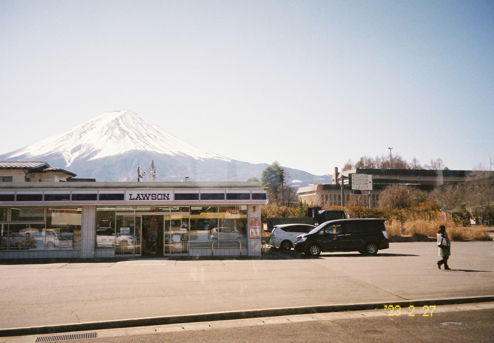
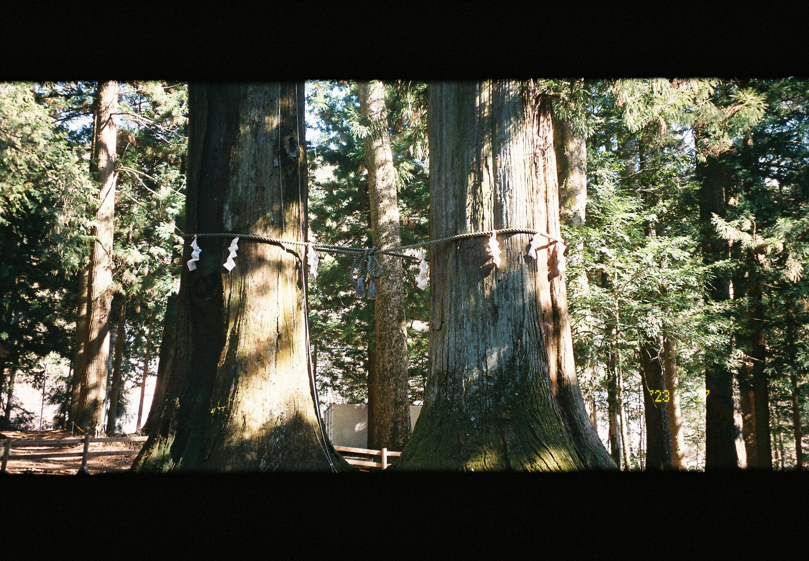

在我看来，来日本不去看富士山，就跟来了北京不去看故宫长城一样。富士山是日本最有代表性的景观之一，横跨了静冈县和山梨县。河口湖（Kawaguchiko）位于山梨县，从东京出发大概需要2个小时左右的车程，在这里可以很好地观赏到富士山。

从东京搭乘公共交通去河口湖，一般都会从新宿站出发。可以搭乘高速巴士，也可以坐富士回游线，我选择的是后者。我买了一张东京广域JR pass，三天之内可以无限次乘坐东京及其周边的JR线路（但是不能坐新干线），其中就包括了富士回游线。为了把JR pass用回本，我第一天去了河口湖，第二天坐了舞女号（踊り子，Odoriko，名字应该来源于川端康成的《伊豆的舞女》）去了热海，第三天原本是想去镰仓的，结果因为实在是太累了便放弃了行程，然后宅在宿舍里写下了这篇博客。

富士回游线上大多都不是日本人，大家都说英文，让日语不好的我有种久违的放松感；第二天去热海的舞女号上，我方圆三米之内全是日本的老爷爷老奶奶，坐我身边的老太太还硬要扯着我聊天，吓得我赶紧装睡才躲过了一劫……扯远了。热海也是一个非常值得一去的观光地，等我照片洗出来之后再好好地写一篇关于热海的博客。

**富士山**

观赏富士山的最佳时机就是在冬日的晴天，此时能见度最高，而我正巧就是在一个大晴天去的河口湖。

河口湖有几个著名的富士山拍照地点，比如河口湖站旁边的罗森便利店，浅间神社的鸟居，还有是日川时计店，除了后者离得太远没有去之外，另外二者我都拍了照片。浅间神社的鸟居前拍照是需要排队的，一组人只有三分钟，我为了拍照爬了半小时的山（人都要热傻了），又排了40分钟的队，拍出来的照片效果也不太好（因此就不在博客里放了），后悔不已。

以下是一些富士山的照片。

在网红打卡点之一——罗森便利店对面拍下的照片。有一大堆游客站在这里合照。

其实上图的罗森不远处还有另一个罗森，我认为那里更加适合拍照，而且鲜有游客驻足。我坐公交时路过了那儿，在车里隔着玻璃按下了快门。

我在一个位于居民区里的法式小餐厅里吃了午饭，并花掉了自己身上剩下的唯一一张钞票。以下是吃完午饭之后在去第三家罗森（小小的一块地方到处都是罗森啊）取钱的路上拍到的富士山。

**美术馆和博物馆**

河口湖有很多博物馆和美术馆，比如宝石博物馆，木ノ花美术馆，八音盒博物馆，河口湖美术馆等等。由于博物馆和美术馆关门都比较早，所以想在一天之内把这几个地方全都逛过去是不太可能的。我只去了前两者。

宝石博物馆旁的湖里有一群天鹅。

一个小小的停船处。

[木ノ花美术馆](http://www.konohana-muse.com/index.html)里展出的都是一位名叫 池田あきこ 的绘本作家的作品。她笔下的绘本主角是一只名叫ダヤン（Dayan）的丹凤眼小猫。虽然美术馆很小很小，看完所有展品只需要二十来分钟，但是里面的每一幅画都非常的梦幻，让人感觉仿佛来到了另一个世界。我觉得这是我那天浏览过的所有景点里最值得去的一个，可爱的小猫谁不喜欢呢。

美术馆门口拍摄的照片，提着灯的小猫就是Dayan。

**浅间神社**

浅间神社的周围长满了杉树，我去的时候正值午后，阳光透过杉树照进来的样子非常好看。

伪宽幅模式拍摄的浅间神社。

两棵杉树。

挂着绘马的架子。

一个小的山神社。

---
**关于照片**

本篇博客里的照片全部由pentax espio145m以及fuji xtra400拍摄。感觉大晴天确实不太适合用高感光度的胶卷。