仙台（Sendai）是我去东北部旅行的第一站，我在这里住了两个晚上。

我觉得国人对仙台的最初印象大多都来源于课本上鲁迅的那篇《藤野先生》。仙台是鲁迅的母校东北大学的所在地，东北大学的校园有鲁迅的雕像，鲁迅上过课的阶梯教室，甚至连鲁迅的翘课记录都能找到。不过很遗憾的是，由于时间问题，我没能够去东北大学的校园里亲自看看。

仙台的特产有牛舌和毛豆，在车站可以买到毛豆奶昔，喝起来甜甜的。本地的名人是伊达政宗，仙台城遗迹里还有他骑马的雕像，纪念品商店里也有很多伊达政宗的周边（虽然感觉这些周边都不太好看）。

我在仙台只去了两个地方，一个是宫城县立美术馆，还有一个是松岛，原本还想去仙台博物馆看看的，但是它近几个月正在装修没有开门。

**仙台市景**

早晨的仙台，步行去宫城县美术馆时拍摄的。

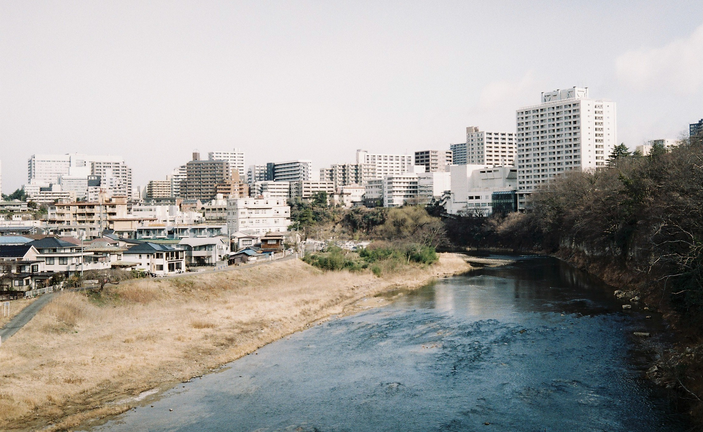

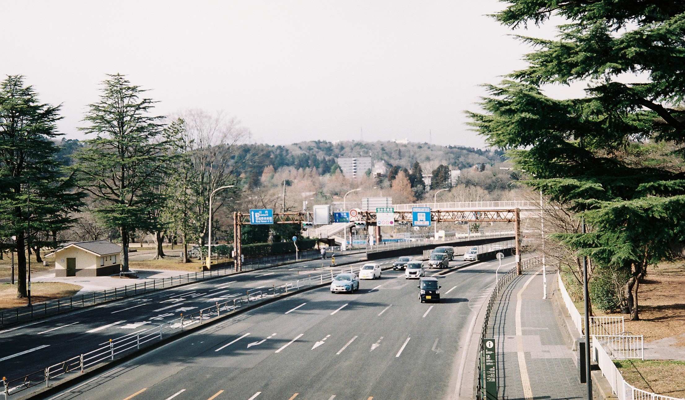

惯例拍个电车。

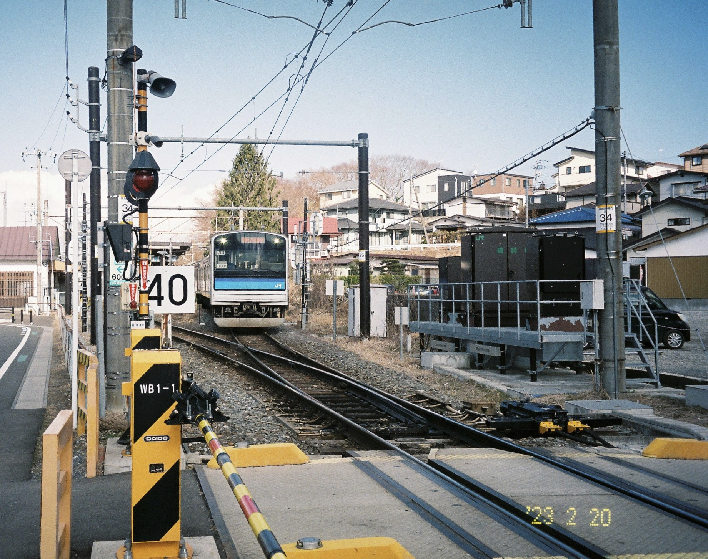

居民区的道路两旁还有一些雪没有化开。

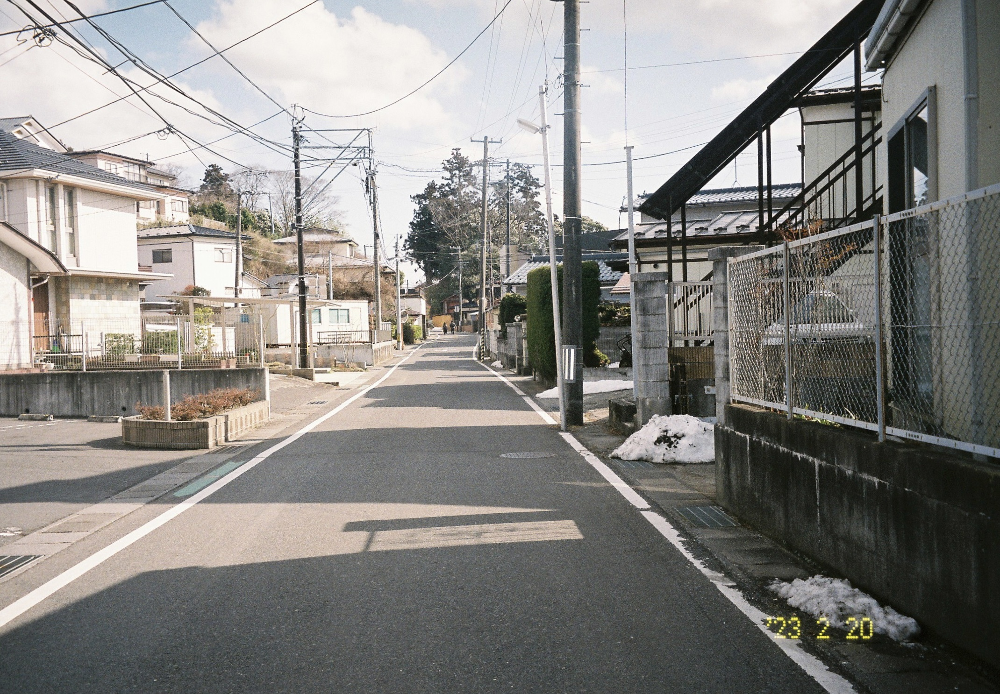

**松岛**

松岛是海上的一个岛屿群，由于岛上长满了松树，所以叫做松岛。从仙台站出发乘坐电车大约1小时可以到松岛附近。可以坐船浏览松岛，耗时大约需要50分钟，我觉得时间太久了就没有坐船。松岛那里有一座福浦桥，可以过桥去福浦岛浏览。

以下是我在步行去福浦桥的路上拍摄下的照片。

海边的停车场

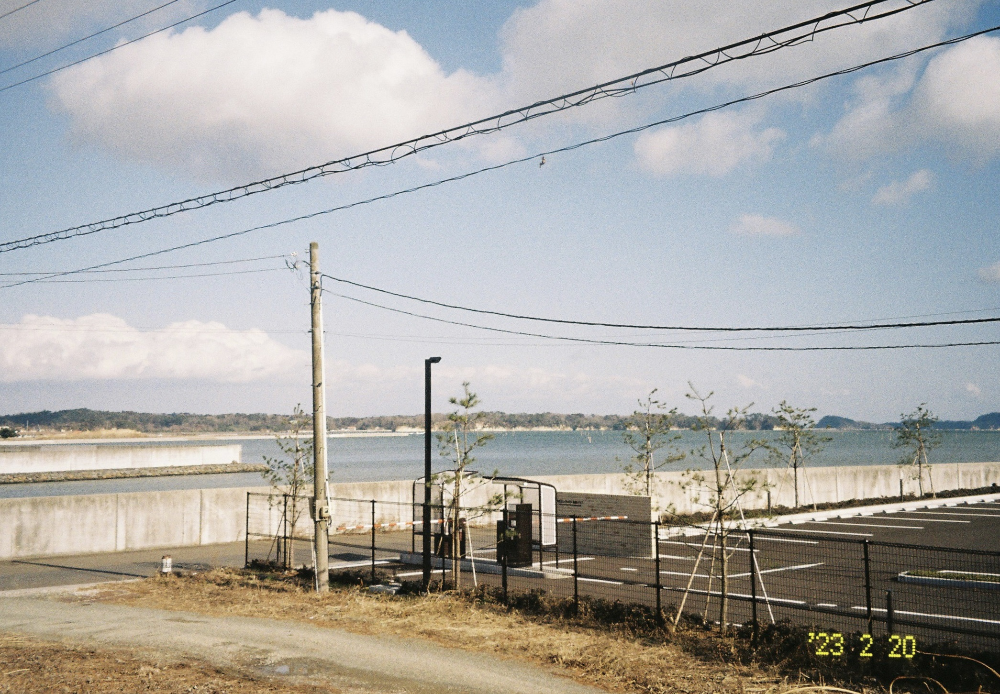

看样子应该是一栋居民楼，真好奇每天拉开窗帘就能看到海是怎么样的感受。

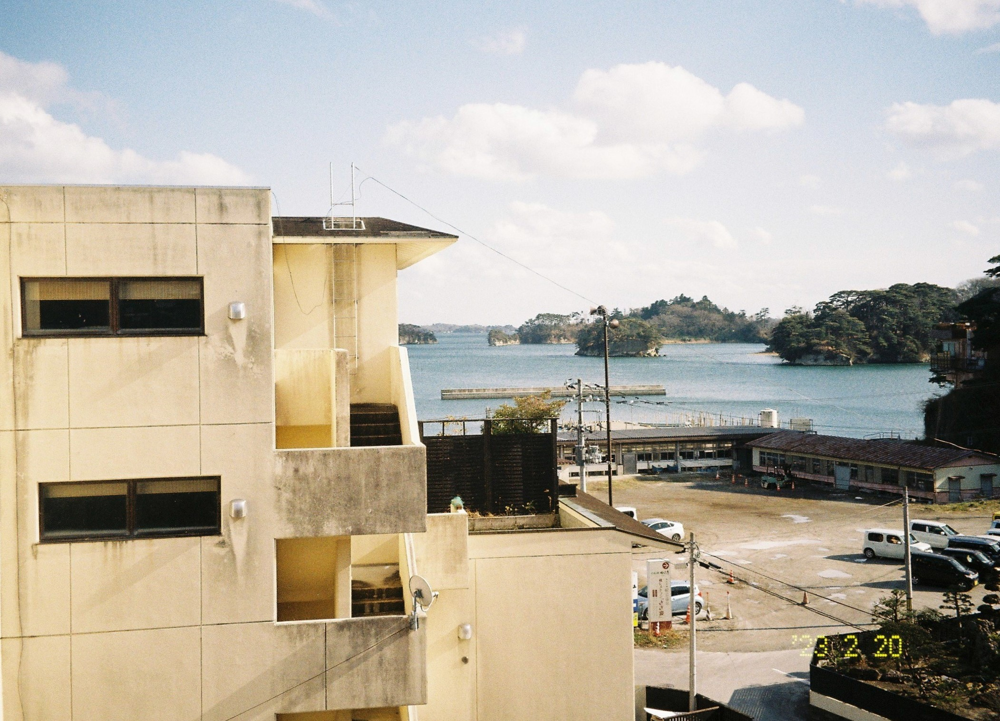

一个小港口

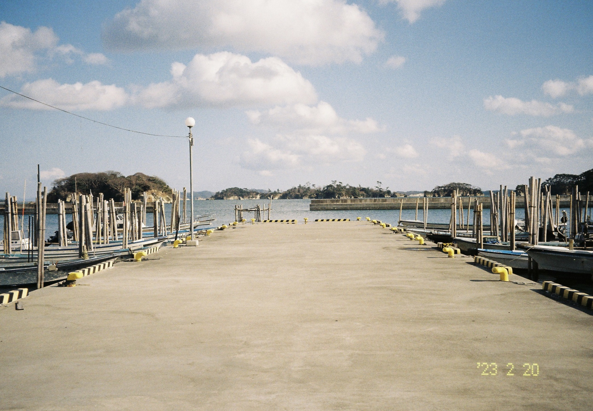

画面正中央就是福浦桥。由于是逆光，拍出来其实不太好看。

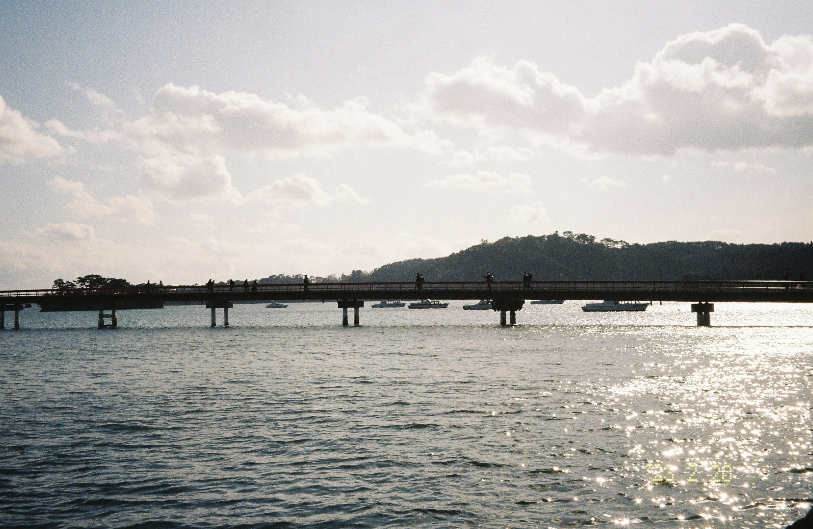

福浦桥是红色的，桥很长，这张照片是我在过桥的时候拍下的。

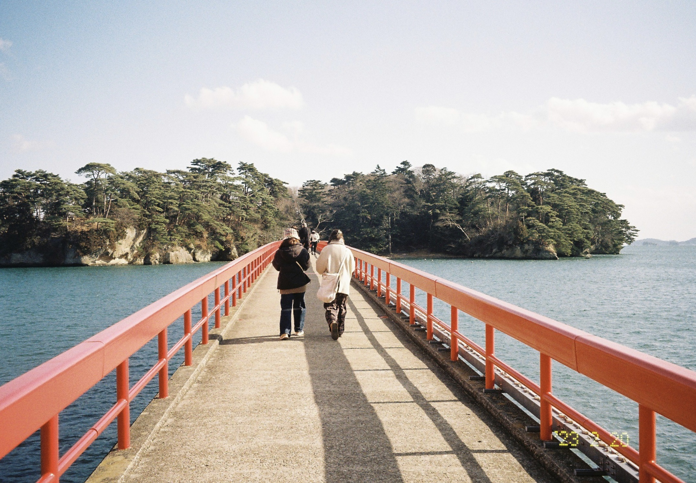

我在福浦岛上倒是没有拍什么照片，只有这一张。

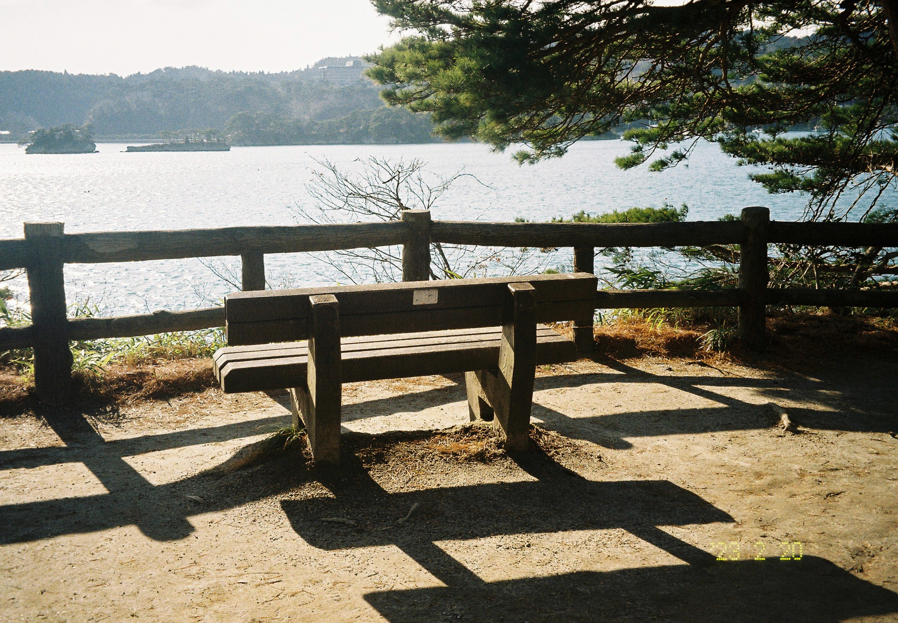

浏览完松岛之后，我在走去电车站的途中发现旁边还有一个寺庙，就顺便进去逛了逛，这张照片是在走去寺庙的路上拍的。

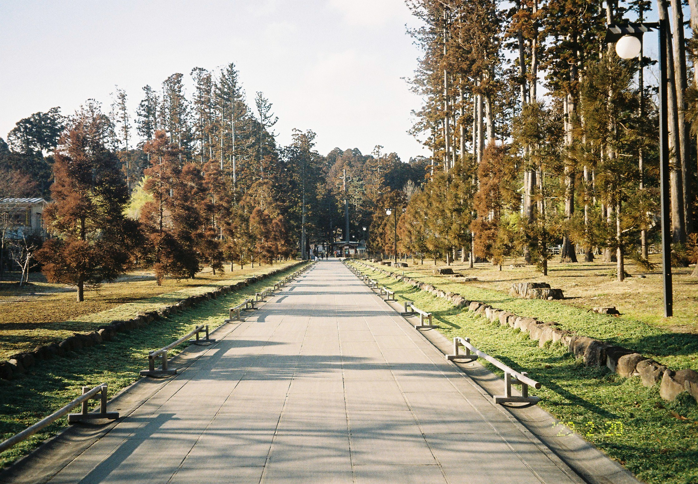

---

**关于照片**

不带日期的照片是由olympus 35dc以及fuji xtra400拍摄，带日期的照片由pentax espio145m以及kodak gold200拍摄。