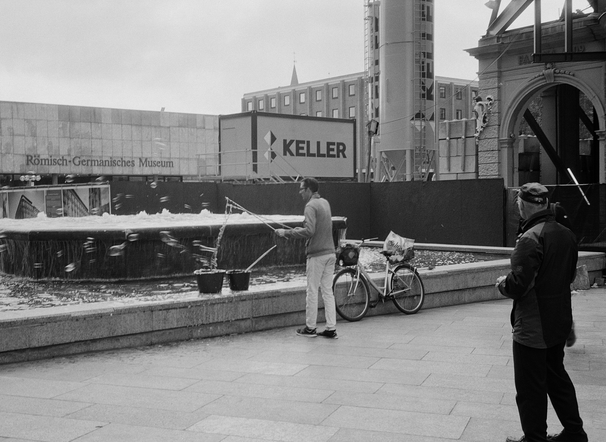

2019年夏末初秋的时候，我刚刚升上大四，报名参加了系里和德国亚琛工大（RWTH Aachen）的暑期学校，为期两周。这两周里，白天在亚琛工大里上课（摸鱼），傍晚在亚琛城里乱逛，周末跑去别的城市玩，过得很是惬意。

从南京飞到法兰克福要10个小时，这是我迄今为止时间最长的一次飞行，也是最难忘的一次。为什么这么说呢？因为我很不幸地在出发前一天感冒了，然后在飞机上发起了高烧……我记得当时我被空姐带到了客舱后面的茶水间里坐着，她拿出了一个长得像纸片一样的薄薄的温度计让我叼在嘴里，测完体温之后，又给了我退烧药和热水袋。虽然最后体温降下去了（顺带一提，还好那时没有新冠疫情），但是闹了这么一出之后，我在这10小时的航行中几乎没有睡着过。

到了德国之后自然是拍了不少照片，照片中记录下的地点有亚琛（Aachen，似乎读作“啊哼”？），科隆，还有荷兰的马斯特里赫特。我还记得当时在市区里偶然看见了一家胶卷店，我在那里买了一卷伊尔福xp2，买完就塞进相机里开始拍，这也是我的第一卷黑白胶卷。当时还吐槽德国的胶卷怎么这么贵，没想到回来之后没多久国内的胶卷价格就起飞了。

在百度网盘里翻出了当时拍的照片，是送去金陵银盐馆冲扫的。不得不说，那个时候技术真烂，一卷里头就没几张能看的。。。。

整理了一些还能看的照片放到博客里，有些照片的拍摄地点我还记得，有些记不清了。

**亚琛**

亚琛工大的大楼。

早晨的街道

住宿地的自动售货机（可惜跑焦了）

亚琛的建筑都很矮，这个可能算是市内比较高的了。

晚上去酒吧，可以看当地人唱歌

**科隆**

xp2应该是在科隆用掉的，在科隆拍的基本上全是黑白照。我感觉德国的建筑氛围挺适合黑白胶片。

在广场上甩泡泡的中年人，当时有很多小孩在旁边跑来跑去。

科隆大教堂，这是我最喜欢的一张。

禄来的相机，好贵呀！

前往亚琛的列车。

火车

**不记得在哪拍的了（或许在荷兰？）**

一家餐厅的灯。

（其实这张跑焦了）

火车内部

----

**关于照片**

全部都由olympus 35dc拍摄，其中黑白照片是ilford xp2，彩色的是kodak ultramax和kodak gold。