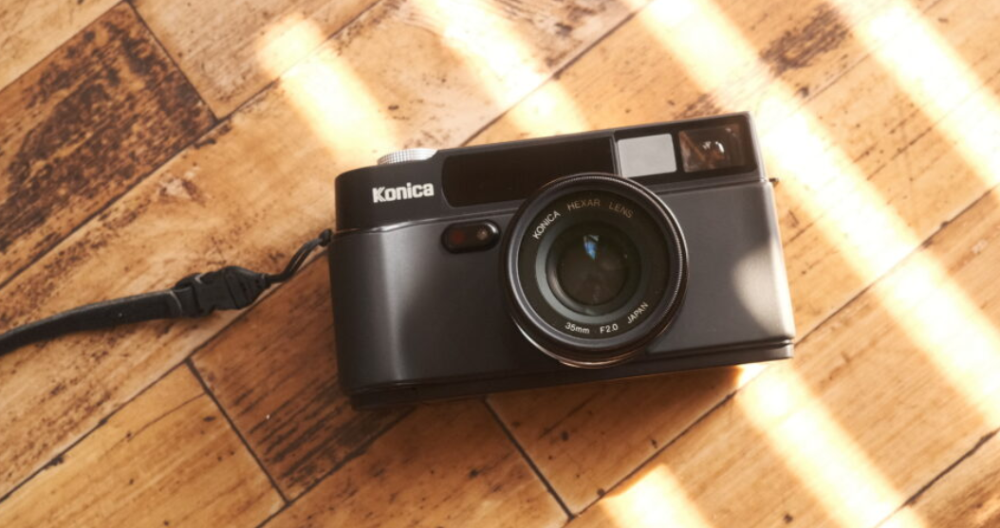
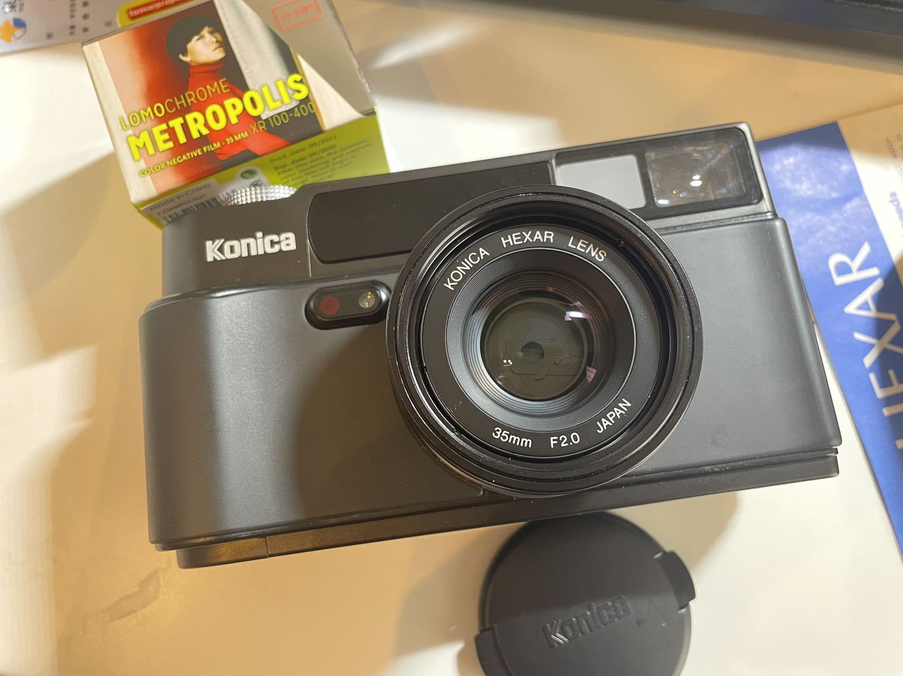

距离我开始拍胶片到现在，已经有差不多四年的时间了。刚刚入门上网查帖子挑选第一台相机的时候，我就注意到了它：

柯尼卡巧思（hexar）AF，全黑色的精致外观让我一见钟情，尤其是相机顶端的“HEXAR”标识，在我看来就是高贵而低调的象征。当时还是个小白的我（现在也是个小白）上网看了无数关于巧思的测评和样片，想买，真的想买，奈何囊中羞涩，再加上自己当时那臭水平用这种相机就是浪费，最终还是没有下手。

四年过去了，胶卷的价格翻了好几倍，不少相机的价格也水涨船高（在此点名批评康泰时t3），但是幸运的是巧思并不在其之中。一两个月前我就筹划着想买一台高端傻瓜机，在巧思、富士klasse和natura之间反复纠结，经过一番对比之后发现巧思有不少毛病。作为一台傻瓜机，它太大太重，在街上拍照太过显眼，怕是也塞不进口袋；1/250的最高快门速度也经常被诟病；它的镜头并不是其他几款傻瓜机那样的伸缩式，而是固定住的，所以每次开拍之前我都得打开镜头盖，巧思又是旁轴取景，这就意味着哪怕拍照的时候镜头盖没开我也不会发觉……这个昔日的女神好像也没有那么的完美嘛。纠结来纠结去，纠结的途中我还买了个宾得的espio小相机先当做代餐凑合着用（意外地出片呢）。直到今天的上午，我最终还是决定圆了四年前的梦，在北村相机店买下了一台巧思。虽说巧思有很多不完美的地方，但是我也不是什么大师，这相机配我是绰绰有余。

我觉得我就像是龙傲天小说里那个大喊着“莫欺少年穷”的少年，经历了一番成长之后，终于娶到了当初那个遥不可及的女神。

相机到手之后感觉很有分量，比我想象得还要大和重，甚至比我的金属外壳的35dc还要重，但是很好看，全黑的相机很有质感。正好前段时间刚刚买了lomography的Metropolis胶卷（lomo之前还有一个和北村相机店联名的东京限定胶卷，很想要，但是好像已经卖完了），装上出门拍照咯！

